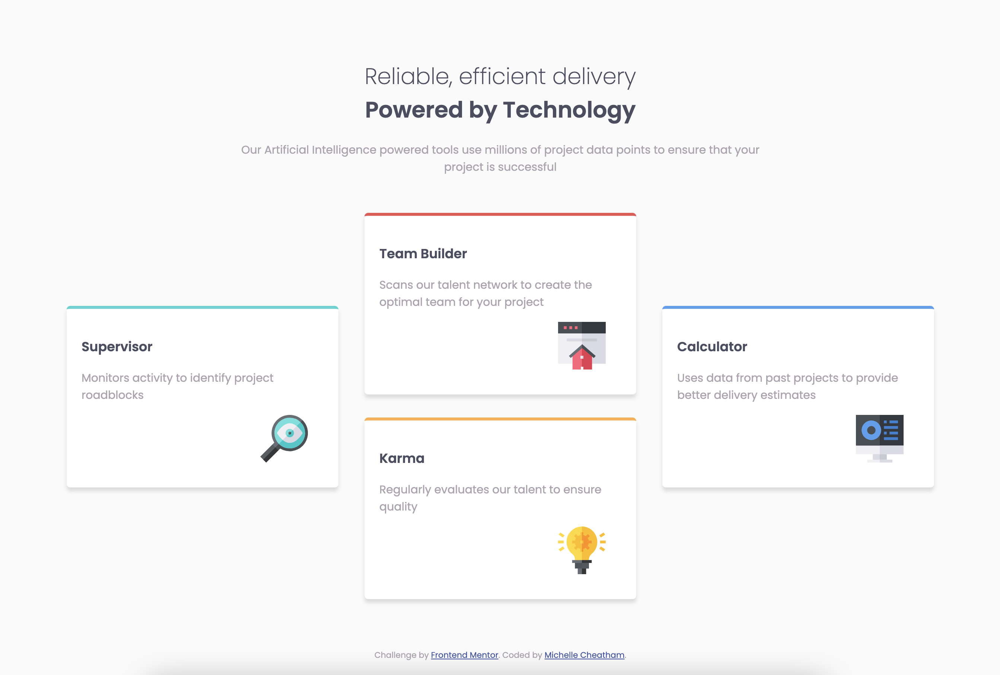
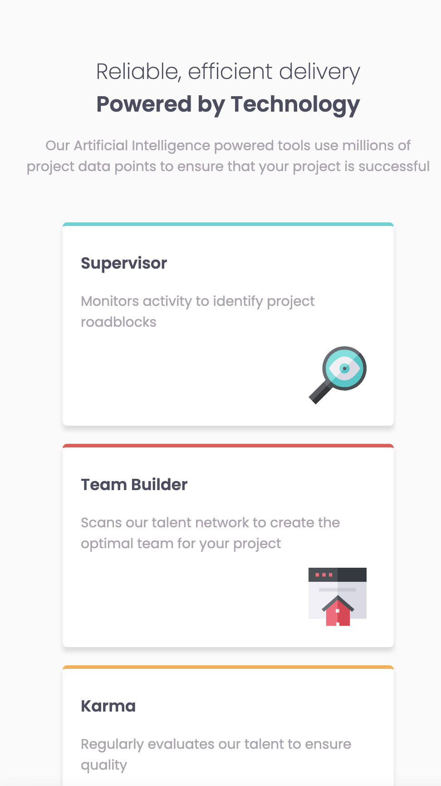

# Frontend Mentor - Four card feature section solution

This is a solution to the [Four card feature section challenge on Frontend Mentor](https://www.frontendmentor.io/challenges/four-card-feature-section-weK1eFYK). Frontend Mentor challenges help you improve your coding skills by building realistic projects. 

## Table of contents

- [Overview](#overview)
  - [The challenge](#the-challenge)
  - [Screenshot](#screenshot)
  - [Links](#links)
- [My process](#my-process)
  - [Built with](#built-with)
  - [What I learned](#what-i-learned)
  - [Continued development](#continued-development)
- [Author](#author)

## Overview

### The challenge

Frontend Mentor has a series of challenges that give you designs (or in this case, just screenshots) for websites, and your task is to implement them. This is one of their "newbie" level tasks -- the primary goal is just to come up with something that switches between the desired full screen and narrow views. As they put it:

Users should be able to:

- View the optimal layout for the site depending on their device's screen size

### Screenshot

### Links

- Solution URL: [https://github.com/mcheatham/four-card-feature-section](https://github.com/mcheatham/four-card-feature-section)
- Live Site URL: [http://www.michellecheatham.com/four-card-feature-section](http://www.michellecheatham.com/four-card-feature-section/)

## My process

### Built with

This is a plain vanilla implementation -- it uses absolute and relative positionining and basic media queries to switch between stylesheets for wide and small screens.

### What I learned

I've found this to be helpful. I'm currently taking a Udemy full stack web dev course that is quite good, but it can't cover everything and some of the exercises are a bit too hand hold-y, so this was a nice way to get some slightly more realistic practice. It was a good project to get bakc into the basics of HTML and CSS.

### Continued development

I plan to use the next project I work on as an opportunity to get more practice with the flex layout.

## Author

- Website - [Michelle Cheatham](https://www.michellecheatham.com)

